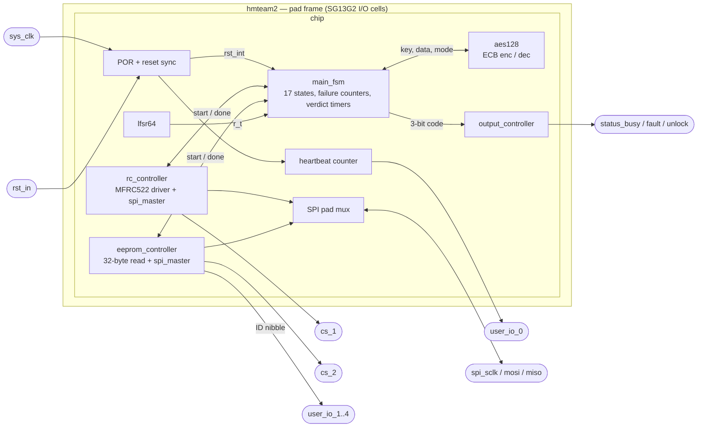

# Architecture

## 1. Overview

LAYR Guardian owns one SPI bus with two peripherals — an NXP MFRC522
reader (`cs_1`) and a serial EEPROM (`cs_2`). After reset it reads the
provisioning data (16-byte authorised card ID, 16-byte AES-128
pre-shared key) from the EEPROM, initialises the MFRC522 and polls for
a card. On a card it runs ISO/IEC 14443-A activation, the LAYR
mutual-authentication exchange with the on-die AES-128 core, and
reports the result on three status pins.

| Parameter | Value |
|---|---|
| Top module | `hmteam2` (pad frame) → `chip` (all logic) |
| Process | IHP SG13G2, 130 nm BiCMOS, open PDK |
| Die / core | 2699 × 2699 µm / 1943 × 1943 µm (`config.yaml`) |
| Pads | 24: 18 signal + 6 supply, 70 × 70 µm bondpads |
| Clock | `sys_clk_PAD`, `CLOCK_PERIOD = 10 ns`, single domain |
| Reset | `rst_in_PAD`, active high, synchronous, plus 128-cycle POR |
| Crypto | AES-128 ECB encrypt and decrypt, one iterative core |
| PRNG | 64-bit Fibonacci LFSR |
| SPI | mode 0, MSB first, `CLK_DIV = 100` |
| Card protocol | ISO/IEC 14443-A, T=CL I-blocks, ISO 7816-4 APDUs |

## 2. Block diagram



## 3. Modules

| Module | File | Role |
|---|---|---|
| `hmteam2` | [`top.v`](../src/rtl/top.v) | Pad frame: SG13G2 I/O cells, supply pads, one `chip` instance |
| `chip` | [`chip.v`](../src/rtl/chip.v) | Core integration, POR, heartbeat, SPI output mux, `user_io` taps |
| `main_fsm` | [`main_fsm.v`](../src/rtl/main_fsm.v) | 17-state protocol sequencer |
| `rc_controller` | [`rc_controller.v`](../src/rtl/rc_controller.v) | MFRC522 driver: register access, transceive engine, 14443-A, APDUs |
| `eeprom_controller` | [`eeprom_controller.v`](../src/rtl/eeprom_controller.v) | 32-byte provisioning read |
| `aes128` | [`aes128.v`](../src/rtl/aes128.v) | AES-128 ECB encrypt/decrypt |
| `spi_master` | [`spi_master.v`](../src/rtl/spi_master.v) | Byte-level full-duplex SPI mode 0 (two instances) |
| `lfsr64` | [`lfsr64.v`](../src/rtl/lfsr64.v) | Nonce source |
| `output_controller` | [`output_controller.v`](../src/rtl/output_controller.v) | Status code → pin decoder (combinational) |

`heartbeat.v`, `out_fsm.v` and `spi_selector.v` are listed in
`VERILOG_FILES` but not instantiated; they are earlier iterations of
logic now in `chip.v` and `main_fsm.v`. `out_fsm.v` encodes an
obsolete 10-state FSM.

## 4. Control style

Every peripheral block exposes the same interface to `main_fsm`: a
single-cycle `…_start` pulse launching one operation, and a
single-cycle `…_done` pulse on completion, with a `…_failure`
qualifier and a 128-bit result bus where applicable. `main_fsm`
deasserts all `start` outputs at the top of every cycle and re-asserts
the one it wants; a `…_started` flag per state ensures one request per
state entry.

## 5. Clocking and reset

Single clock domain `sys_clk`; no derived or gated clocks. `spi_sclk`
is a data output generated by a counter in `spi_master`.

```verilog
reg [7:0] por_cnt = 8'd0;
always @(posedge sys_clk) if (!por_cnt[7]) por_cnt <= por_cnt + 1'b1;
reg [1:0] rst_pipe = 2'b00;
wire rst_int = rst_pipe[1] | ~por_cnt[7];
always @(posedge sys_clk) rst_pipe <= {rst_pipe[0], rst};
```

Power-on reset: `rst_int` is held for the first 128 cycles. External
reset: `rst_in` (active high) through a two-flop synchroniser.

## 6. SPI bus sharing

Each controller has its own `spi_master` and drives its own `mosi` /
`sclk`; `chip` selects which pair reaches the pads:

```verilog
assign spi_mosi = (spi_device_select == 2'b10) ? ee_mosi : rc_mosi;
assign spi_sclk = (spi_device_select == 2'b10) ? ee_sclk : rc_sclk;
```

`spi_device_select` (from `main_fsm`): `00` none, `01` MFRC522, `10`
EEPROM. The chip-selects are not muxed: each controller drives its
own, high while idle. `spi_miso` fans out to both controllers.

## 7. Module notes

### `rc_controller`

One flat state register, four layers:

| Layer | States | Function |
|---|---|---|
| Operation | `IDLE`, `I_*`, `RQ*`, `AC*`/`CR*`/`RT*`/`RP*`, `IS*`/`IG*`/`IA*`/`AU*`, `DONE_*` | init, REQA poll, activation, APDU exchanges; arbitrates the six `start` inputs in fixed priority |
| Transceive engine | `T_IDLE` … `T_FST` | flush FIFO → load `txb` → `BitFramingReg` → `Transceive` → poll `ComIrqReg` → check `ErrorReg` (mask `0x13`) → drain FIFO into `rxb_flat` |
| Register access | `S0` → `S3` | two SPI bytes under one CS: `{rw_n, addr[5:0], 0}` then data; caller sets `rw`, `ra`, `wd` and return state `ret` |
| `spi_master` | 4 states | byte shift register, `CLK_DIV = 100` |

Each layer calls the one below by setting its parameters and a
return state, then jumping.

### `aes128`

Iterative AES-128 ECB core, area-oriented:

- Round keys are generated on the fly; decryption first runs the
  forward key schedule to reach rk[10], then walks it backwards.
- SubBytes is serial: one S-box lookup per cycle (`FSM_SUB_RUN`),
  a single S-box instance instead of sixteen.

The banner comment in `aes128.v` quotes cycle counts from an earlier
parallel-S-box version and is outdated. No side-channel
countermeasures ([security.md](security.md)).

### `spi_master`

Mode 0 (CPOL = 0, CPHA = 0), MSB first, full duplex; MOSI driven while
`sclk` is low, MISO sampled on the rising edge; `tx_start` ignored
while `busy`; `rx_data` valid on the `done` cycle.

### `lfsr64`

64-bit Fibonacci LFSR, taps 63/62/60/59, free running, seeded
`0xDEADBEEFCAFEBABE` at reset. `main_fsm` samples the whole word when
it needs `r_t`.

### `output_controller`

Combinational 3-bit code → `busy`/`fault`/`unlock`; undefined codes
drive all outputs low.

## 8. Timing

Single clock, synchronous reset, the only asynchronous input
double-registered; no multicycle or false paths declared. Post-route
STA: typical and fast corners meet 10 ns; at the slow corner the
fanout of the AES state register `u_aes.fsm[*]` into the 128-bit
datapath violates setup ([physical.md](physical.md) §4).
