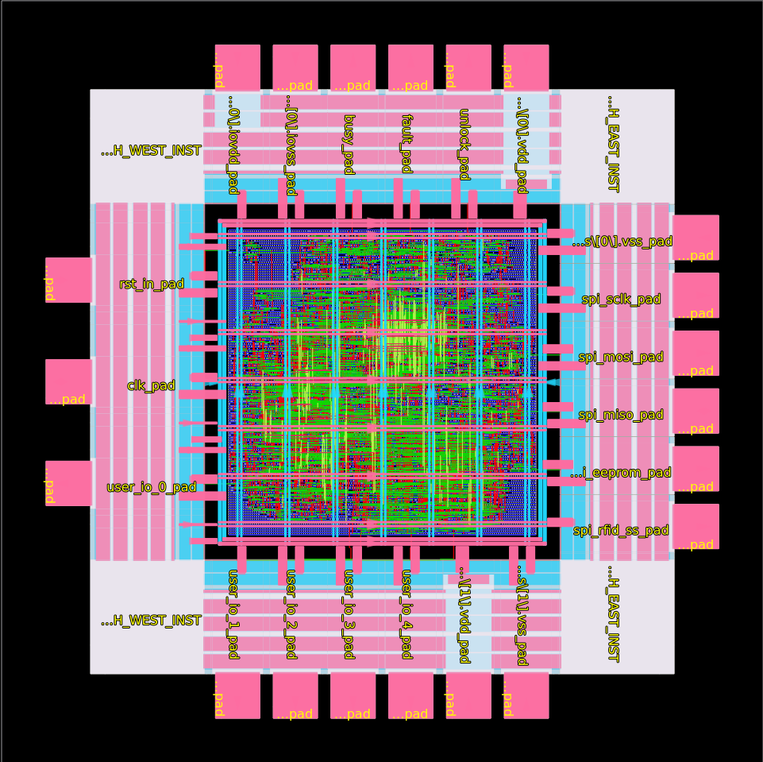

# Physical implementation

## 1. Flow

[LibreLane](https://github.com/librelane/librelane) on the IHP SG13G2
open PDK, pinned via a Nix flake to commit `e73adbd`:

```nix
inputs.librelane.url =
  "github:librelane/librelane/e73adbd885e0a33efe131f4ea40f4f93efeb4247";
```

`USE_SLANG: true` selects the slang front end; the RTL uses a few
SystemVerilog constructs (`logic`, `always_comb`, `genvar` inside
`generate`).

## 2. Floorplan and pad ring

| Setting | Value | Notes |
|---|---|---|
| `DESIGN_NAME` | `hmteam2` | pad frame in `src/top.v` |
| `CLOCK_PERIOD` / `CLOCK_PORT` | 10 ns / `sys_clk_PAD` | `CLOCK_NET: clk_pad/p2c` |
| `FP_SIZING` | `absolute` | |
| `DIE_AREA` | `[0, 0, 2699, 2699]` µm | |
| `CORE_AREA` | `[378, 378, 2321, 2321]` µm | 378 µm ring for I/O cells and bondpads |
| `PDN_CORE_RING` | true, 15 µm wide, 5 µm spacing | two 15 µm straps stay under the 30 µm slotting limit |
| `PDN_CORE_RING_CONNECT_TO_PADS` | true | |
| `PDN_ENABLE_PINS` | false | pads are the only supply entry |
| `GRT_ALLOW_CONGESTION` | true | |
| `MAGIC_EXT_UNIQUE` | `notopports` | |

24 SG13G2 I/O cells, six per side (`PAD_NORTH/EAST/SOUTH/WEST` in
`config.yaml`; pin table in [integration.md](integration.md)). Supply
pads: 1 × `IOPadIOVdd`, 1 × `IOPadIOVss`, 2 × `IOPadVdd`, 2 ×
`IOPadVss`, instantiated in single-iteration `generate` loops so the
instance names carry an index.

Bondpads are two hard macros merged via `EXTRA_GDS` / `EXTRA_LEFS`:
`bondpad_70x70` (`CLASS COVER`, pad port on Metal2 through TopMetal2)
and `bondpad_70x70_novias` (no via stack, for pads over routing).
Both, and the three dummy UART pads, are in
`IGNORE_DISCONNECTED_MODULES`.



*Development-run screenshot (smaller die than the final config). Pad
order is the same as in the tapeout: north row left→right `IOVDD,
IOVSS, busy, fault, unlock, VDD` = pins 24→19.*

## 3. Checks

`substituting_steps` disables three:

| Step | Reason |
|---|---|
| `Checker.IllegalOverlap` | Magic reports overlaps in the pad/bondpad stack for this PDK |
| `Magic.DRC`, `Checker.MagicDRC` | KLayout DRC used instead |

KLayout antenna, density, XOR and IR-drop remain enabled; the
commented-out blocks in `config.yaml` are development switches.

## 4. Sign-off results

Post-route STA (OpenROAD, RCX parasitics), IR drop and power from the
tapeout run of `hmteam2`, `CLOCK_PERIOD = 10 ns`.

| Corner | Setup WNS | Setup violations | Hold WNS | Hold violations |
|---|---:|---:|---:|---:|
| fast `nom_fast_1p32V_m40C` | +3.97 ns | 0 | +0.09 ns | 0 |
| typ `nom_typ_1p20V_25C` | +1.86 ns | 0 | +0.28 ns | 0 |
| slow `nom_slow_1p08V_125C` | −2.88 ns | 307 (TNS −292 ns) | +0.38 ns | 0 |

| Metric | Value |
|---|---|
| Max-slew violations | 20 (slow corner; 1 at typ) |
| Max-fanout violations | 267 |
| IR drop, VDD | 6.35 mV worst, 4.8 mV average (worst node 1.19 V) |
| IR drop, VSS | 5.66 mV worst |
| Power (typ, STA estimate) | 23.1 mW total — 18.9 mW internal, 4.0 mW switching, 0.21 mW leakage |
| Standard cells | 29 557 — 2 959 flip-flops, 6 035 timing-repair buffers, 414 clock buffers, 140 clock inverters |
| Core utilisation | 11.1 % |
| Pad ring | 204 I/O-ring cells (18 signal, 6 supply, 180 spacers) + 24 bondpads |
| Antenna | 0 violating nets / pins (67 diodes inserted) |
| Detailed-route DRC | 0 |
| KLayout XOR (Magic vs. KLayout stream-out) | 0 differences |
| KLayout density | 21 fill-density errors (Metal2 ×9, Metal3 ×10, Metal4 ×2), deferred — metal fill is inserted by IHP |

### Timing at the slow corner

10 ns is met at the typical and fast corners. At the slow corner
(1.08 V, 125 °C) 307 register-to-register paths violate setup, worst by
2.88 ns, corresponding to a slow-corner period of ≈ 12.9 ns (≈ 77 MHz).
The failing paths are the high-fanout nets driven by the AES core's
state register (`u_aes.fsm[*]`); each state bit selects the datapath
operation for the whole 128-bit state. 6 035 timing-repair buffers
were inserted on these paths.

No timing fix was attempted; the project ended at tapeout. At nominal
supply and room temperature the chip is expected to operate at
100 MHz. For operation across all corners `sys_clk` should be ≤ 75 MHz
(internal timings scale, see [integration.md](integration.md) §3).
A respin could duplicate or one-hot encode the AES state bits.

Two flow observations:

- `unknown command 'abc'` appears at the end of
  `yosys-synthesis.log`. ABC executes and maps correctly and reports
  the error only at the end; the `output_controller` cocotb bench on
  the mapped netlist matched the RTL, so `ERROR_ON_SYNTH_CHECKS` was
  relaxed.
- Floating `VDD`/`VSS` warnings are expected for pad-based power
  injection with an auto-generated PDN.

The die size is set by the 24 bondpads, not by the logic.
