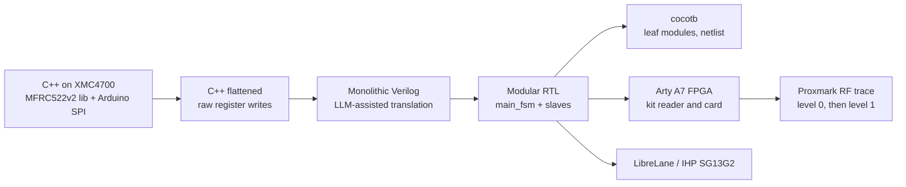
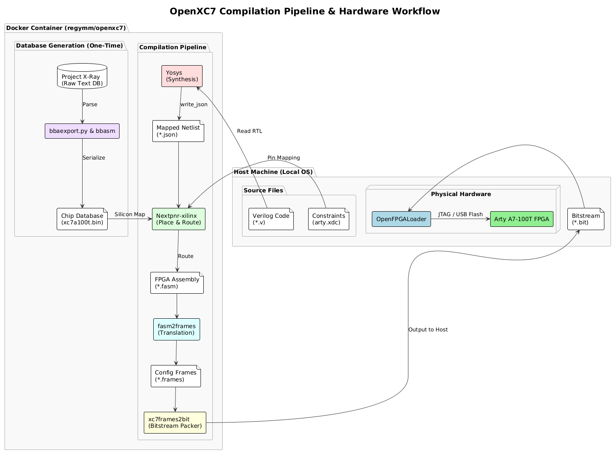

# Team, context and approach

## 1. Team

hmteam2 — Hochschule München (HM), Munich University of Applied
Sciences

| Member | Focus |
|---|---|
| Valentin Buttner | C++ reference design (XMC4700), C++ → Verilog conversion, RC522/card protocol, RF verification |
| Florian Herrnberger | Synthesis debugging, `config.yaml` flow configuration |
| Emilia Jaser | cocotb testbenches, Nix flake / shared development environment |
| Felix Kreil | Physical implementation, LibreLane flow, floorplan and pad ring |
| Julian Rapp | FPGA workflow (Arty A7), ESP32 SPI probe, hardware bring-up |

Supervisor: [Prof. Dr. Stefan Wallentowitz](https://hm.edu/kontakte_de/contact_detail_38978.de.html)

## 2. Context

The design was built in a two-week block course ("Hardware / Software
Codesign") by five students, most without prior HDL or RFID
experience. Conditions worth knowing when reading the rest of the
documentation:

- The LAYR reference bitstream targets the ULX3S; the team had Digilent
  Arty A7-100T boards, so there was no reference behaviour to compare
  against. A C++ reference on a microcontroller was written instead.
- The MFRC522 module in the kit was defective, which cost about two
  days before it was identified with an oscilloscope and a second
  module.
- Specification reading, reference implementation, RTL, tests, FPGA
  bring-up, RF verification, ASIC flow and tapeout configuration were
  done in ten working days, with a daily jour fixe.
- Proxmark3 and ESP32 used for debugging were the team's own
  equipment.

The level-1 protocol work (AES core, authentication states) followed
in March, before tapeout.

## 3. Approach

The protocol was first implemented in C++ on an XMC4700 with library
support, then flattened to raw `wrReg`/`rdReg` calls so that every
byte, register and delay was explicit. The Proxmark's `hf 14a raw` and
`hf 14a list` commands were used here to see how the card responded
and to correct the register setup.

The flattened C++ served as the blueprint for a monolithic Verilog
version, generated with LLM assistance and debugged on the FPGA with
LEDs. It was then split into `main_fsm` and peripheral modules sharing
one `start`/`done` handshake, which is what later allowed the AES core
and the level-1 states to be added.

Leaf modules were tested in cocotb; the SPI physical layer with the
ESP32 probe; the protocol on the FPGA with the kit reader and card,
observed with the Proxmark. The LibreLane flow was set up in parallel
on a lecture example and a larger open-source core, so pad frame, PDN
and sign-off configuration were ready when the design was.

## 4. Environment

One `flake.nix` for the team: it inherits the LibreLane devShell via
`inputsFrom` and adds cocotb, pytest, graphviz and utilities. A hash
mismatch in `nix-eda`'s `yosys-eqy` was worked around with the FOSSi
binary cache; the upstream fix is
[nix-eda#47](https://github.com/fossi-foundation/nix-eda/pull/47).

FPGA builds ran in the `regymm/openxc7` Docker image (Yosys →
nextpnr-xilinx → fasm → bitstream) with `openFPGALoader` on the host.

