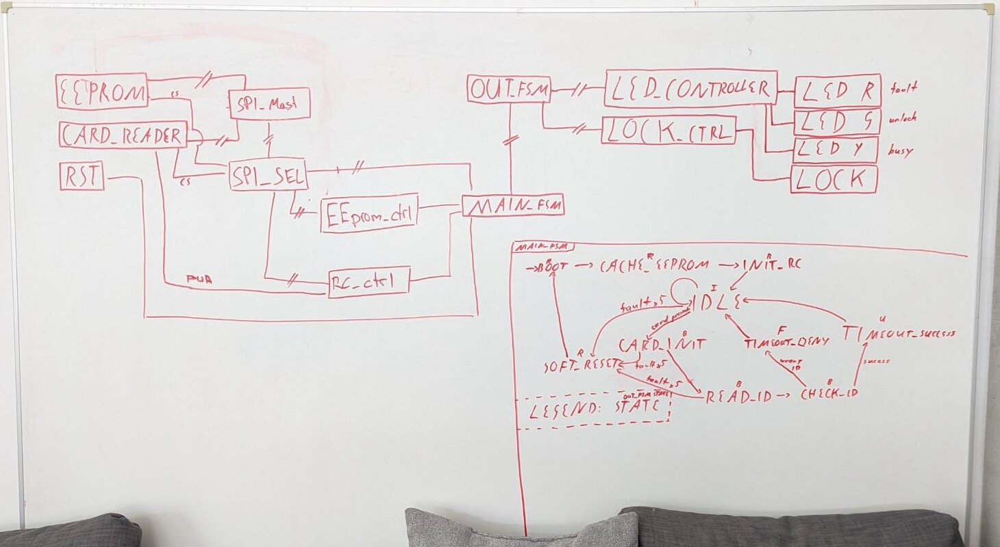

# Operating sequence

Chip-specific details only. The card protocol itself (APDUs,
`AUTH_INIT` / `AUTH` / `GET_ID`, key agreement) is defined by the
challenge:
[protocol specification](https://github.com/OCDCpro/LAYR/tree/main/challenge#protocol-specification),
[JavaCard applet](https://github.com/OCDCpro/javacard-applet).

## 1. Main state machine

`main_fsm` is a flat 17-state Moore machine with synchronous
active-high reset landing in `S_SOFT_RESET`. It runs the provisioning
sequence once, then loops between polling and card transactions.

```mermaid
stateDiagram-v2
    direction LR
    [*] --> S_SOFT_RESET : rst_int
    S_SOFT_RESET --> S_BOOT
    S_BOOT --> S_CACHE_EEPROM
    S_CACHE_EEPROM --> S_INIT_RC : eeprom_cache_done
    S_INIT_RC --> S_IDLE : rc_init_done
    S_IDLE --> S_CARD_INIT : ATQA received
    S_IDLE --> S_SOFT_RESET : any fail counter ≥ 5
    S_CARD_INIT --> S_AUTH_INIT : SELECT + RATS ok
    S_CARD_INIT --> S_IDLE : fail (card_init_fail++)
    S_AUTH_INIT --> S_AES_DEC1 : C1 received
    S_AUTH_INIT --> S_IDLE : fail (auth_fail++)
    S_AES_DEC1 --> S_VERIFY_RC : AES done
    S_VERIFY_RC --> S_AES_ENC1 : low 64 bits == 0
    S_VERIFY_RC --> S_TIMEOUT_DENY : bad padding (auth_fail++)
    S_AES_ENC1 --> S_AUTH : AES done
    S_AUTH --> S_AES_ENC2 : 90 00
    S_AUTH --> S_TIMEOUT_DENY : fail (auth_fail++)
    S_AES_ENC2 --> S_READ_ID : k_eph formed
    S_READ_ID --> S_AES_DEC2 : C3 received
    S_READ_ID --> S_IDLE : fail (auth_fail++)
    S_AES_DEC2 --> S_CHECK_ID : AES done
    S_CHECK_ID --> S_TIMEOUT_SUCCESS : ID == EEPROM ID
    S_CHECK_ID --> S_TIMEOUT_DENY : mismatch
    S_TIMEOUT_SUCCESS --> S_IDLE : timer
    S_TIMEOUT_DENY --> S_IDLE : timer
```



Whiteboard from the design phase (February, level-0 stage): module
structure on the left, the then 10-state `MAIN_FSM` on the right with
the output state (R/I/B/F/U) noted at each state. The `S_AUTH_*` and
`S_AES_*` states were added later.



| # | State | Status | Action / exit | On failure |
|---|---|---|---|---|
| 0 | `S_BOOT` | RESET | single-cycle entry | — |
| 1 | `S_CACHE_EEPROM` | RESET | read 32 provisioning bytes | — |
| 2 | `S_INIT_RC` | RESET | soft-reset and configure the MFRC522 | — |
| 3 | `S_IDLE` | IDLE | REQA poll until ATQA | → `S_SOFT_RESET` if any counter ≥ `MAX_FAILURES` |
| 4 | `S_CARD_INIT` | BUSY | anticollision, SELECT, RATS | `card_init_fail_count`++, → IDLE |
| 5 | `S_AUTH_INIT` | BUSY | SELECT AID, `AUTH_INIT` → 16 B | `auth_fail_count`++, → IDLE |
| 6 | `S_AES_DEC1` | BUSY | decrypt C₁ under PSK | — |
| 7 | `S_VERIFY_RC` | BUSY | latch r_c; require low 64 bits = 0 | `auth_fail_count`++, → DENY |
| 8 | `S_AES_ENC1` | BUSY | sample r_t from LFSR, encrypt r_t‖r_c | — |
| 9 | `S_AUTH` | BUSY | send C₂ in `AUTH` APDU | `auth_fail_count`++, → DENY |
| 10 | `S_AES_ENC2` | BUSY | form k_eph = r_c‖r_t (one cycle, no AES) | — |
| 11 | `S_READ_ID` | BUSY | `GET_ID` → 16 B | `auth_fail_count`++, → IDLE |
| 12 | `S_AES_DEC2` | BUSY | decrypt C₃ under k_eph | — |
| 13 | `S_CHECK_ID` | BUSY | 128-bit compare with EEPROM ID | → DENY |
| 14 | `S_TIMEOUT_DENY` | FAULT | hold `TIMEOUT_DENY` cycles → IDLE | — |
| 15 | `S_TIMEOUT_SUCCESS` | UNLOCK | hold `TIMEOUT_SUCCESS` cycles → IDLE | — |
| 16 | `S_SOFT_RESET` | RESET | clear all flags/counters/timers → `S_BOOT` | — |

`TIMEOUT_DENY = TIMEOUT_SUCCESS = 300 000 000` cycles (3 s at
100 MHz), `MAX_FAILURES = 5`.

`S_AES_ENC2` forms `k_eph` by concatenation, as the challenge
specifies; the `main_fsm.v` header comment describes an AES derivation
that is not implemented. The code is authoritative.

## 2. Provisioning read

```
cs_2 low → [0x03 READ] [0x00 addr] [32 dummy bytes clocked out] → cs_2 high
```

| Bytes | Register slice | Port | Content |
|---|---|---|---|
| 0–15 | `eed_flat[255:128]` | `eeprom_id_data` | authorised card ID |
| 16–31 | `eed_flat[127:0]` | `eeprom_key_data` | AES-128 PSK |

Byte 0 → `eeprom_id_data[127:120]`. The top nibble of byte 0 is
mirrored on `user_io_1..4` ([integration.md](integration.md) §7).

## 3. Reader bring-up

1. Write `0x0F` (SoftReset) to `CommandReg`.
2. Wait `DLY50M = 5 000 000` cycles; poll `CommandReg` until PowerDown
   (bit 4) clears; up to three retries.
3. Write configuration:

| Register | Addr | Value | Purpose |
|---|---|---|---|
| `TxModeReg` | 0x12 | 0x00 | TX CRC off, 106 kbit/s Type A |
| `RxModeReg` | 0x13 | 0x00 | RX CRC off, 106 kbit/s |
| `ModWidthReg` | 0x24 | 0x26 | modulation width |
| `TModeReg` | 0x2A | 0x80 | timer auto-start at end of TX |
| `TPrescalerReg` | 0x2B | 0xA9 | timer prescaler |
| `TReloadRegH/L` | 0x2C/2D | 0x03E8 | timer reload |
| `TxASKReg` | 0x15 | 0x40 | force 100 % ASK |
| `ModeReg` | 0x11 | 0x3D | CRC preset 6363, TX wait on RF |

4. Read `TxControlReg`; if the antenna bits are not set, write them.
5. Read `VersionReg` (value not checked).

`I_EVAL` proceeds to `DONE_OK` after the third failed retry, so
`rc_init_done` asserts whether or not a reader answered.

## 4. Card detection and activation

In `S_IDLE` the chip sends REQA (`0x26`, 7 bits via
`BitFramingReg = 0x07`). A card is present when the FIFO returns
exactly two bytes (ATQA).

| Step | Frame | Expect |
|---|---|---|
| Anticollision | `93 20` | ≥ 5 B: UID CL1 + BCC |
| CRC | — | CRC-A over the 7-byte SELECT body via the MFRC522 `CalcCRC` command |
| SELECT | `93 70` + UID + BCC + CRC | ≥ 3 B: SAK + CRC |
| RATS | `E0 50` | ATS; FSDI = 5, CID = 0 |

`CollReg` is cleared to `0x80` before anticollision. Before RATS
`TxModeReg = 0x80`; after the ATS `RxModeReg = 0x80` (hardware CRC-A
from here on) and the timer is re-programmed (`TModeReg = 0x8D`,
`TPrescalerReg = 0x3E`) to allow the card time for its AES operations.
A `DLY10M` guard closes the state.

## 5. Application exchange

T=CL I-blocks, PCB `0x02`/`0x03` alternating on each successful
exchange, followed by the ISO 7816-4 APDU. Every response is rejected
unless it ends in `90 00` and carries the expected payload length.
`rc_auth_init_start` performs `SELECT AID` and `AUTH_INIT` together;
`rc_read_id_start` sends `GET_ID` only, as the applet is already
selected. The I-block toggle `itgl` is reset only by a module reset.

## 6. Verdict and failure handling

`S_CHECK_ID` is a single-cycle 128-bit equality against
`eeprom_id_data`: one identity, all-or-nothing. Both verdict states
hold for the same number of cycles.

| Counter | Incremented by | Effect |
|---|---|---|
| `card_init_fail_count` | `S_CARD_INIT` | activation failed |
| `auth_fail_count` | `S_AUTH_INIT`, `S_VERIFY_RC`, `S_AUTH`, `S_READ_ID` | authentication failed |
| `poll_fail_count` | — (never incremented) | — |

When any counter reaches `MAX_FAILURES`, `S_IDLE` diverts to
`S_SOFT_RESET`: EEPROM re-read, MFRC522 re-initialised. Counters are
cumulative per boot, not consecutive.

Frame-level errors: `ErrorReg & 0x13` (buffer overflow, parity,
protocol) aborts a frame; the MFRC522 hardware timer terminates a
stalled frame. The software `TMO` counter counts poll iterations, not
cycles, and does not act as an effective watchdog.
