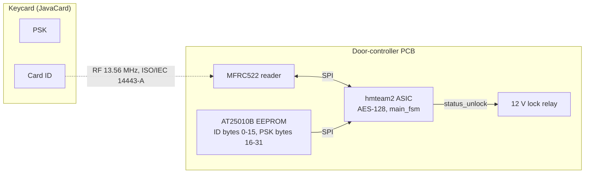

# Security by design

Claimed level: 1 — LAYR Authenticated Identification Protocol.

The chip implements the mutual challenge–response protocol from the
challenge specification (`AUTH_INIT` / `AUTH` / `GET_ID`) with an
on-die AES-128 core. Levels 2 and 3 (side-channel and fault-injection
countermeasures) are not implemented.

## 1. System and trust boundaries

| Boundary | Who can reach it | Assumed attacker capability |
|---|---|---|
| RF air interface | anyone within a few cm | full read and inject of 14443-A frames |
| SPI buses (reader, EEPROM) | anyone with physical access to the PCB | probe, replay, replace the EEPROM |
| ASIC die | lab attacker | power/EM measurement, glitching — out of scope at level 1 |
| Lock output | anyone with access to the wiring | shorting `status_unlock`; physical security of the wiring is the integrator's responsibility |

Per the challenge note for levels 1–3, secure storage of the long-term
PSK is out of scope: the key is stored in the external SPI EEPROM in
the clear.

## 2. Assets

| Asset | Where | Confidentiality | Integrity |
|---|---|---|---|
| A1 Long-term PSK (128 bit) | EEPROM bytes 16–31, cached in `main_fsm` | high | high |
| A2 Authorised card ID (128 bit) | EEPROM bytes 0–15, cached | medium | high |
| A3 Card ID as transmitted | RF, inside `C₃` | medium | — |
| A4 Session nonces `r_c`, `r_t` | RF, inside `C₁`/`C₂` | high per transaction | — |
| A5 `status_unlock` | pin | — | high |

## 3. Threats and mitigations

Notation: `C₁ = AES_psk(r_c ‖ 0⁶⁴)`, `C₂ = AES_psk(r_t ‖ r_c)`,
`k_eph = r_c ‖ r_t`, `C₃ = AES_k_eph(ID)`.

| # | Threat | Vector | Mitigation in this design | Residual risk |
|---|---|---|---|---|
| T1 | Passive eavesdropping of the ID | sniff RF | ID crosses the air only as `C₃`, encrypted under a per-transaction key; nonces only under the PSK | none at protocol level, given AES-128 and a secret PSK |
| T2 | Replay of a recorded exchange | replay `C₁…C₃` | fresh `r_t` every transaction; a replayed `C₃` decrypts to garbage → `S_CHECK_ID` mismatch → FAULT | `r_t` predictability, see T6 |
| T3 | Card emulation without the PSK | emulate a card | `C₁` must decrypt to a block with 64 zero low bits (`S_VERIFY_RC`); chance without the key 2⁻⁶⁴ | — |
| T4 | Rogue reader harvesting IDs | attacker-operated MFRC522 | card releases `C₃` only after the reader returned `r_c` in `C₂` (enforced on the card per applet spec) | card-side property |
| T5 | Relay / man-in-the-middle | forward frames between a distant card and the reader | not prevented; no distance bounding in 14443-A | out of scope for all four levels |
| T6 | Nonce prediction | model the LFSR | 64-bit LFSR, seeded `0xDEADBEEFCAFEBABE` at reset, sampled at the moment the card answers `AUTH_INIT`; unpredictability comes from card-arrival time | an attacker who controls reset and transaction timing can predict `r_t`; a TRNG or persisted seed would fix this |
| T7 | Timing oracle on the verdict | measure status-pin timing | deny and grant hold the same number of cycles; ID compare is single-cycle | which protocol stage failed is visible from the RF traffic anyway |
| T8 | Brute force at the reader | present many bad cards | five cumulative failures since boot trigger a full soft reset; every failed attempt costs a FAULT hold | counters are cumulative, not consecutive |
| T9 | EEPROM substitution | rewrite or swap the EEPROM | not mitigated — out of scope per challenge rules | on-die OTP or an authenticated EEPROM would be needed |
| T10 | SPI bus probing | logic analyser on the PCB | PSK and ID cross the EEPROM bus in the clear at boot; reader bus carries only ciphertexts | out of scope, see T9 |
| T11 | Power side-channel on AES | traces during `S_AES_DEC1`/`S_AES_ENC1` | not implemented | level 2 not claimed |
| T12 | Fault injection | glitch to skip `S_CHECK_ID` or force `S_TIMEOUT_SUCCESS` | not implemented; binary state encoding, no redundancy | level 3 not claimed |
| T13 | Reset-line abuse | hold `rst_in` high | chip stays in reset, status = RESET, lock closed | — |
| T14 | Missing reader | unplug the MFRC522 | `rc_init_done` asserts regardless; polls fail; lock stays closed | no "reader absent" signal |

## 4. Design choices

A single iterative AES core with a serial S-box was chosen for area;
cryptography is a small part of a transaction compared with SPI
register traffic. Deny and grant hold the status pins for the same
number of cycles and the ID compare is single-cycle. The level-0
cleartext `GET_ID` path is not implemented. `S_VERIFY_RC` rejects a
malformed `C₁` before the chip sends `C₂`. `k_eph = r_c ‖ r_t` follows
the applet specification; the `main_fsm.v` header comment describing
an AES derivation is outdated.

Level 2 would require a masked AES core and a TRNG; level 3 a
redundant FSM with illegal-state detection and a redundant ID compare.
Both fit behind the existing `start`/`done` module interface.

Known weaknesses are listed in [evaluation.md](evaluation.md) §2.
